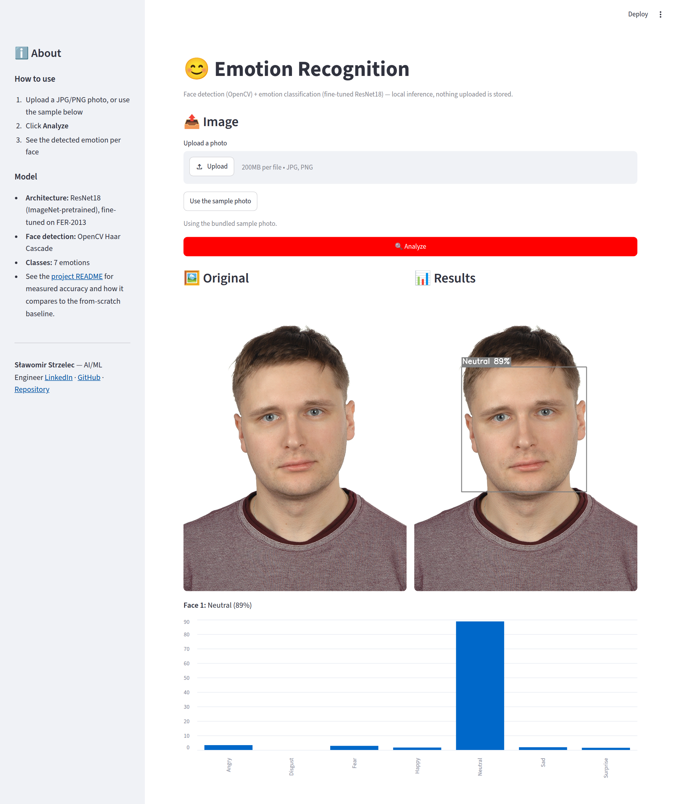
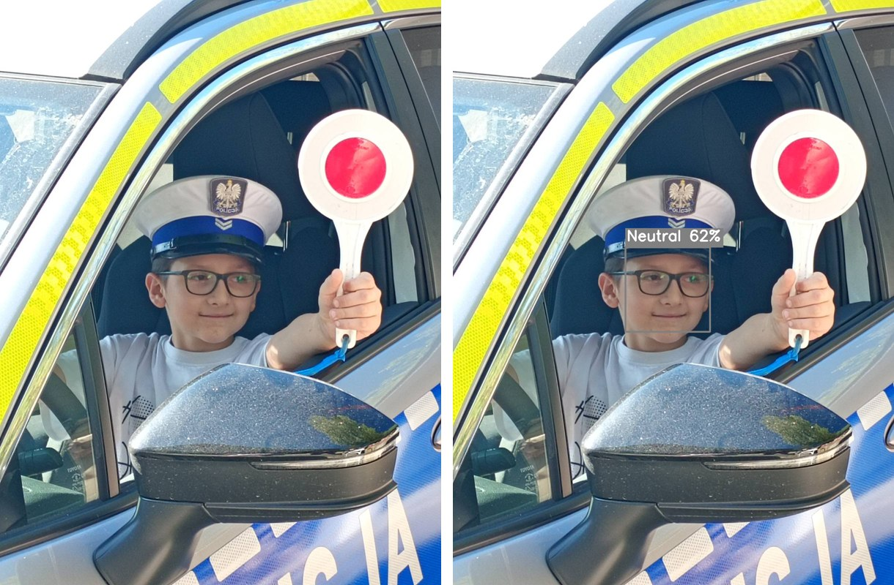
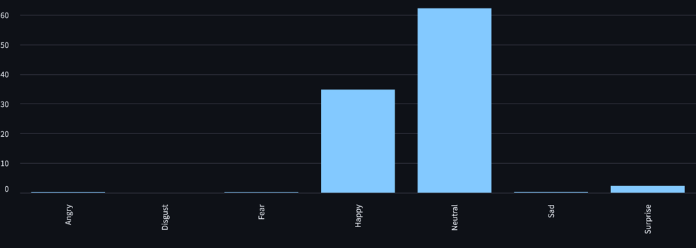

# 😊 Emotion Recognition

Face detection + facial emotion classification, running entirely locally —
no image you upload is ever sent to a third-party API or stored on disk.

**Live demo:** https://emotion-recognition-cv.streamlit.app/  
**Repository:** https://github.com/slastrzelec/emotion-recognition-cv


## What it does

Upload a photo (or use the bundled sample). The app detects faces with an
OpenCV Haar Cascade, then classifies each detected face into one of 7
emotions (Angry, Disgust, Fear, Happy, Neutral, Sad, Surprise) using a
fine-tuned ResNet18, and shows the per-emotion probability breakdown.



## Example





A casual photo, outside the FER-2013 distribution. The model predicts **Neutral (62%)**, with **Happy (35%)** as the second guess — a faint smile splits the probability between the two, which is typical for subtle expressions.

## How it works

- **Face detection:** OpenCV Haar Cascade (`haarcascade_frontalface_default.xml`).
- **Emotion classification:** ResNet18, pretrained on ImageNet and
  fine-tuned on [FER-2013](https://www.kaggle.com/datasets/msambare/fer2013)
  (35,888 grayscale 48×48 face crops, 7 classes).
- Everything runs in memory; nothing uploaded is written to disk or sent
  anywhere outside this app.

## Why transfer learning instead of a from-scratch CNN

This project replaces an earlier version that trained a small custom CNN
from scratch and reached 59.64% test accuracy — below the ~65% human-level
baseline commonly cited for FER-2013. At FER-2013's size (~36k images), a
pretrained backbone's features transfer well and overfit less than a small
CNN trained from zero, so this rebuild uses that as the primary approach.
The old CNN architecture was retrained under several training pipelines
and kept as an explicit baseline for comparison below — the honest
comparison is part of the point.

## Measured results

All numbers are measured by `evaluate.py` on the FER-2013 test split
(7,178 images); nothing here is asserted ahead of time.

| Model | Training pipeline | Test accuracy | Macro F1 |
|---|---|---|---|
| **ResNet18** (transfer learning, used by the app) | augmentation + class weights + LR schedule | **67.96%** | 0.66 |
| CNN from scratch | no augmentation, no class weights | 63.11% | 0.53 |
| CNN from scratch | augmentation, no class weights (stopped at the 40-epoch cap, still improving) | 61.54% | — |
| CNN from scratch | augmentation + class weights + LR schedule | 51.70% | 0.45 |
| Old project's CNN (different pipeline, for reference) | — | 59.64% | — |

What this shows, and what it doesn't:

- Transfer learning beats the best from-scratch CNN by about **4.9
  points of accuracy** and about **13 points of macro F1**.
- The full pipeline that helps the ResNet *hurts* the small CNN: with class
  weights and augmentation it underfits badly (51.70%). The CNN is
  therefore reported with its best-working pipeline, and the ResNet with
  its own — the comparison is "best effort per model", not an identical
  pipeline. Part of the macro-F1 gap (see Disgust below) comes from this
  difference in pipeline, not from the architecture alone.
- Checkpoint selection and early stopping use the test split, because the
  FER-2013 copy used here ships train/test only. Every accuracy above is
  therefore slightly optimistic.
- The ~68–72% target in `SPEC.md` was not reached: the ResNet ends just
  under its lower bound. For context, human-level accuracy on FER-2013 is
  estimated at ~65% and the published single-model state of the art
  without extra training data is ~73% (Khaireddin & Chen, 2021 —
  arXiv:2105.03588).

### Per-class results (test split)

| Class | Support | ResNet18 P / R / F1 | Best CNN P / R / F1 |
|---|---|---|---|
| Angry | 958 | 0.585 / 0.644 / 0.613 | 0.540 / 0.524 / 0.532 |
| Disgust | 111 | 0.573 / 0.739 / 0.646 | 0.000 / 0.000 / 0.000 |
| Fear | 1024 | 0.592 / 0.440 / 0.505 | 0.510 / 0.374 / 0.432 |
| Happy | 1774 | 0.886 / 0.854 / 0.870 | 0.853 / 0.835 / 0.844 |
| Neutral | 1233 | 0.598 / 0.693 / 0.642 | 0.566 / 0.628 / 0.595 |
| Sad | 1247 | 0.580 / 0.533 / 0.556 | 0.475 / 0.592 / 0.527 |
| Surprise | 831 | 0.742 / 0.835 / 0.786 | 0.775 / 0.785 / 0.780 |

Happy and Surprise are recognized well; **Fear** is the weakest class for
the ResNet (recall 0.44, mostly confused with Sad, Angry, Neutral and
Surprise), and **Sad** is often mistaken for Neutral. The CNN trained
without class weights never predicts Disgust at all. The ResNet's Disgust
numbers rest on only 111 test images, so treat them as indicative, not
precise.

## Training

```bash
pip install -r requirements.txt -r requirements-train.txt
python train.py --model resnet --epochs 40
```

The rows of the results table are reproduced with:

```bash
python train.py --model resnet --epochs 40                                          # ResNet18
python train.py --model cnn --epochs 40 --no-class-weights --no-augment --tag plain # best CNN
python train.py --model cnn --epochs 40 --no-class-weights --tag aug_noweights      # CNN, augmentation only
python train.py --model cnn --epochs 40                                             # CNN, full pipeline
```

`--tag` only changes the checkpoint file name (`checkpoints/cnn_plain_best.pt`
and so on), so runs don't overwrite each other.

Meant to run on a free GPU notebook (Google Colab or Kaggle), not on the
Streamlit deployment host — CPU training at this scale takes many hours.
On Colab, torch and torchvision are already installed with a GPU build, so
don't reinstall them:

```python
!git clone https://github.com/slastrzelec/emotion-recognition-cv.git
%cd emotion-recognition-cv
!pip install -q opencv-python-headless Pillow numpy scikit-learn kagglehub
!python train.py --model resnet --epochs 40
```

`train.py` downloads FER-2013 via `kagglehub` on first run (needs a
Kaggle API token — see [kagglehub's docs](https://github.com/Kagglehub/kagglehub)
for setup; never hardcode credentials in this repo).

## Evaluating a checkpoint

```bash
python evaluate.py --checkpoint checkpoints/resnet_best.pt --model resnet --data-dir <path-to-fer2013>/test
```

## Data security & privacy

- All inference is local — no uploaded image is ever sent to a
  third-party API.
- Uploaded images are processed in memory only; nothing is persisted to
  disk beyond what's strictly required to decode it.
- No logging or retention of uploaded content between sessions.
- Upload size and file type are validated before processing.

See `SPEC.md` for the full specification this project was built against,
written and reviewed before any code was.

## Limitations, stated plainly

- Face detection is a Haar Cascade — it's fast and dependency-free, but
  misses faces at extreme angles, poor lighting, or partial occlusion
  more often than a modern deep-learning face detector would.
- Trained and evaluated on FER-2013, a posed/curated dataset — accuracy
  on casual, in-the-wild photos will likely be lower than the numbers
  reported above.
- FER-2013 has noisy labels and subtle expressions; Fear, Sad and Neutral
  are confused with each other even by the best model (see the per-class
  table above).
- `disgust` has only 111 test images, so its per-class numbers are
  statistically weak.
- All accuracies are slightly optimistic because the best checkpoint was
  chosen on the test split (no separate validation set).

## Tech stack

PyTorch · torchvision (ResNet18) · OpenCV · Streamlit · scikit-learn (evaluation metrics)

## License

MIT
